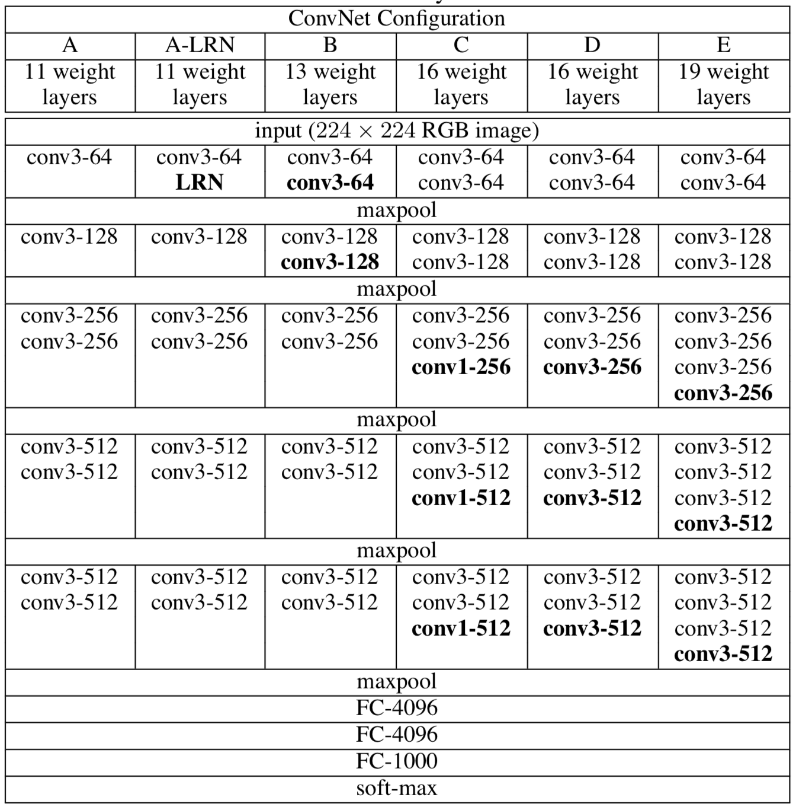

# VGGs in TensorFlow

This repository comes with VGG implementation in TensorFlow. VGG took the 2nd place of the ILSVRC-2014 Competition.

Currently, the VGG models in this repo have been tested with CIFAR-10 and CIFAR-100 dataset. As an indivisual deep learner, it is hard to manage such a huge dataset, ImageNet. However, I will keep working on the ImageNet dataset, please wait for it.

> **VGG:** Visual Geometry Group @Oxford University

## Required Packages
- scikit-images
- pickle
- tqdm
- numpy
- tensorflow-gpu (>1.7)

## Usage
- From command line
  - Will download CIFAR-10 or CIFAR-100 dataset and pre-process of it, and run the training on VGG. It will produce the checkpoint file for performing inference later.
```
python vgg.py --model-type ['A'|'A-LRN'|'B'|'C'|'D'|'E'] --dataset ['cifar10'|'cifar100']
```

- From source code
```python
import cifar10_utils
import cifar100_utils
from vgg import VGG

...
valid_set = (valid_features, valid_labels)
...

# model type, D is the most well known VGG16 without 1D conv layer
# check the bottom section to see what model types are supported
vggNet = VGG(dataset='cifar10', model_type='D', learning_rate=0.0001)
vggNet.train(epochs=10, 
              batch_size=128, 
              valid_set=valid_set, 
              save_model_path='./model')
```

## Experiment on CIFAR-10 dataset (Not Yet Tested)
- Environment
  - Floydhub GPU2 instance (1 x Tesla V100)

## Configurations
- **A :** 11 weight layers
- **A-LRN :** 11 weight layers with Local Response Normalization
- **B :** 13 weight layers
- **C :** 16 weight layers with 1D conv layers 
- **D :** 16 weight layers
- **E :** 19 weight layers

